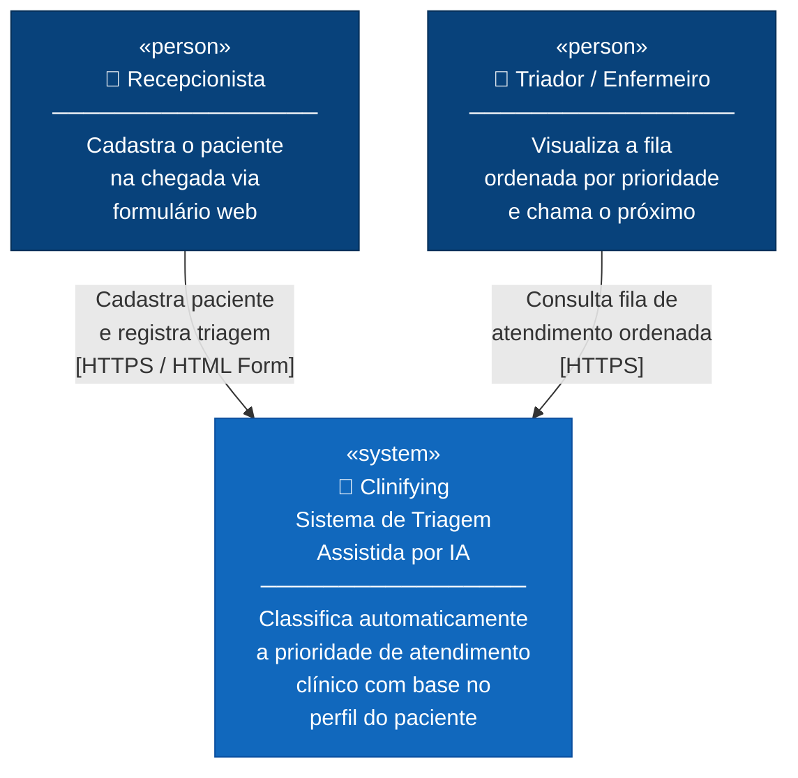

# C4 Model — Nível 1: Diagrama de Contexto
**Sistema:** Clinifying — Sistema de Triagem Assistida por IA  
**Nível:** 1 de 4  
**Pergunta respondida:** Quem usa o sistema e com quais sistemas externos ele se comunica?

> O diagrama de contexto mostra o sistema como uma caixa preta no centro do universo.  
> Foco em **pessoas** e **sistemas externos** — sem entrar em tecnologia.

---

## Diagrama

---

## Descrição dos elementos

### Pessoas (Usuários)

| Ator | Papel | Interação com o sistema |
|------|-------|------------------------|
| **Recepcionista** | Primeiro contato do paciente na chegada | Preenche o formulário web com: nome, idade, gênero, motivo, comorbidades, internações. Visualiza a prioridade retornada. |
| **Triador / Enfermeiro** | Responsável por chamar os pacientes | Consulta a fila de atendimento ordenada por prioridade (urgente no topo). Não precisa inserir dados. |

### Sistema

| Sistema | Tipo | Descrição |
|---------|------|-----------|
| **Clinifying** | `[system]` | Sistema único (monolito) que recebe dados de triagem, classifica a prioridade com regras determinísticas e exibe a fila ordenada. Não se integra com sistemas externos. |

### Sistemas externos

Nenhum. O sistema é autossuficiente:
- Sem gateway de pagamento
- Sem sistema de prontuário eletrônico
- Sem integração com APIs externas
- Banco de dados embutido (H2 in-memory)

---

## Decisões de contexto

- **Escopo mínimo:** apenas dois atores humanos, sem sistemas externos — simplifica o desenvolvimento e a demo
- **Sem autenticação:** qualquer pessoa na rede local acessa o sistema (decisão do hackathon)
- **Sistema demonstrativo:** não deve ser conectado a sistemas reais de saúde

---

## Navegação do C4 Model

| Nível | Arquivo | Pergunta respondida |
|-------|---------|-------------------|
| **1 — Contexto** | `nivel-1-contexto.md` ← *você está aqui* | Quem usa e quais sistemas externos? |
| 2 — Contêineres | [nivel-2-containers.md](nivel-2-containers.md) | O que está dentro do sistema? |
| 3 — Componentes | [nivel-3-componentes.md](nivel-3-componentes.md) | O que está dentro do Backend API? |
| 4 — Código | [nivel-4-codigo.md](nivel-4-codigo.md) | Como as classes se relacionam? |
