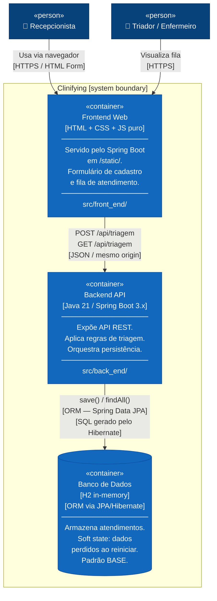

# C4 Model — Nível 2: Diagrama de Contêineres
**Sistema:** Clinifying — Sistema de Triagem Assistida por IA  
**Nível:** 2 de 4  
**Pergunta respondida:** O que está dentro do sistema? Quais as tecnologias e responsabilidades de cada parte?

> Abrimos a caixa preta do Nível 1.  
> Mostramos os **contêineres** (processos, apps, bancos) e como eles se comunicam.

---

## Diagrama



---

## Descrição dos contêineres

### Frontend Web
| Atributo | Valor |
|----------|-------|
| **Tecnologia** | HTML5 + CSS3 + JavaScript ES6+ (sem frameworks) |
| **Localização no projeto** | `src/front_end/` → empacotado em `static/` pelo Maven |
| **Servido por** | Spring Boot (mesmo processo do Backend, sem CORS) |
| **URL** | `http://localhost:8080/` |
| **Responsabilidade** | Formulário de cadastro, exibição de prioridade com cor, tabela de fila |
| **Comunica com** | Backend API via `fetch()` usando URLs relativas (`/api/triagem`) |
| **Equipe** | Time Frontend |

### Backend API
| Atributo | Valor |
|----------|-------|
| **Tecnologia** | Java 21 + Spring Boot 3.x |
| **Localização no projeto** | `src/back_end/` → compilado pelo Maven |
| **URL base** | `http://localhost:8080/api/` |
| **Swagger UI** | `http://localhost:8080/swagger-ui.html` |
| **Responsabilidade** | Validação de entrada, classificação de prioridade, persistência JPA |
| **Comunica com** | H2 via Spring Data JPA (ORM) |
| **Equipe** | Time Backend |

### Banco de Dados (H2)
| Atributo | Valor |
|----------|-------|
| **Tecnologia** | H2 Database (embedded, in-memory) |
| **ORM** | Hibernate via Spring Data JPA |
| **JDBC URL** | `jdbc:h2:mem:triagem` |
| **Console** | `http://localhost:8080/h2-console` |
| **DDL Strategy** | `create-drop` (schema criado ao iniciar, destruído ao parar) |
| **Padrão de consistência** | BASE (Basically Available, Soft state, Eventually consistent) |
| **Persistência** | Volátil — dados perdidos ao reiniciar (comportamento esperado) |

---

## Padrão BASE aplicado ao H2

| Propriedade BASE | Como se aplica ao H2 in-memory |
|-----------------|-------------------------------|
| **Basically Available** | Banco embutido no JVM — sem rede, sem I/O de disco, sem pontos de falha externos |
| **Soft state** | Dados são transientes — estado "amolece" ao reiniciar o processo |
| **Eventually consistent** | Em JVM único com transações Spring: toda leitura vê o write mais recente |

---

## Fluxo de comunicação

```
Navegador (Recepcionista)
    │
    │  GET http://localhost:8080/          → carrega index.html (Frontend Web)
    │  POST http://localhost:8080/api/triagem → registra triagem (Backend API)
    │  GET  http://localhost:8080/api/triagem → lista fila (Backend API)
    ▼
Spring Boot (porta 8080)
    ├── /         → serve src/front_end/ (arquivos estáticos)
    ├── /api/**   → TriagemController (REST)
    ├── /swagger-ui.html → springdoc-openapi
    └── /h2-console      → H2 web console
```

---

## Navegação do C4 Model

| Nível | Arquivo | Pergunta respondida |
|-------|---------|-------------------|
| 1 — Contexto | [nivel-1-contexto.md](nivel-1-contexto.md) | Quem usa e quais sistemas externos? |
| **2 — Contêineres** | `nivel-2-containers.md` ← *você está aqui* | O que está dentro do sistema? |
| 3 — Componentes | [nivel-3-componentes.md](nivel-3-componentes.md) | O que está dentro do Backend API? |
| 4 — Código | [nivel-4-codigo.md](nivel-4-codigo.md) | Como as classes se relacionam? |
