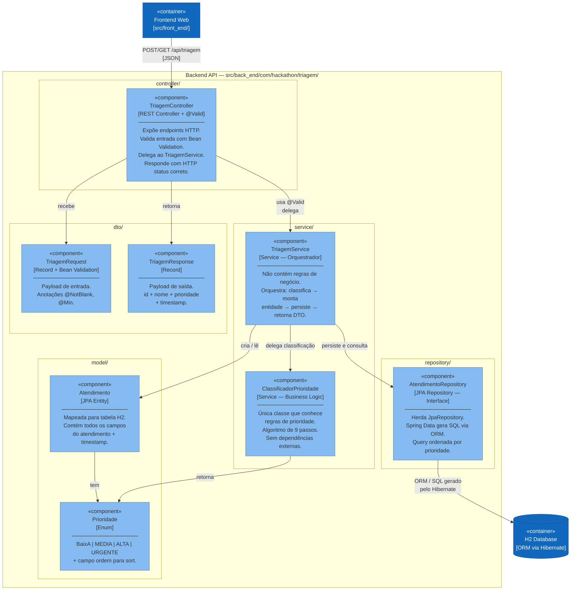

# C4 Model — Nível 3: Diagrama de Componentes
**Sistema:** Clinifying — Sistema de Triagem Assistida por IA  
**Nível:** 3 de 4  
**Contêiner em foco:** Backend API (`src/back_end/`)  
**Pergunta respondida:** Quais são os componentes dentro do Backend API e como eles se relacionam?

> Abrimos o contêiner **Backend API** do Nível 2.  
> Cada componente corresponde a uma classe ou interface Java com responsabilidade única (SOLID — SRP).

---

## Diagrama



---

## Descrição dos componentes

### Camada: controller/

| Componente | Arquivo | Responsabilidade SOLID |
|-----------|---------|----------------------|
| `TriagemController` | `TriagemController.java` | **S** — recebe HTTP, valida, delega, responde. Zero lógica de negócio. |

### Camada: service/

| Componente | Arquivo | Responsabilidade SOLID |
|-----------|---------|----------------------|
| `TriagemService` | `TriagemService.java` | **S** — orquestra a operação. Não sabe como classificar, não sabe como persistir. Apenas coordena. |
| `ClassificadorPrioridade` | `ClassificadorPrioridade.java` | **S** — única responsabilidade: aplicar o algoritmo de 9 passos. **O** — pode ser estendido via herança/interface se novas regras surgirem. |

### Camada: repository/

| Componente | Arquivo | Responsabilidade SOLID |
|-----------|---------|----------------------|
| `AtendimentoRepository` | `AtendimentoRepository.java` | **I** — interface enxuta com apenas o método de consulta adicional. **D** — `TriagemService` depende desta interface, não de uma implementação concreta. |

### Camada: model/

| Componente | Arquivo | Responsabilidade SOLID |
|-----------|---------|----------------------|
| `Atendimento` | `Atendimento.java` | **S** — portador de dados persistido. Sem lógica de negócio. |
| `Prioridade` | `Prioridade.java` | **S** — enum que representa domínio e carrega ordenação. |

### Camada: dto/

| Componente | Arquivo | Responsabilidade SOLID |
|-----------|---------|----------------------|
| `TriagemRequest` | `TriagemRequest.java` | **S** — portador de dados de entrada com validação declarativa. |
| `TriagemResponse` | `TriagemResponse.java` | **S** — portador de dados de saída. Imutável (record). |

---

## Princípios SOLID aplicados

| Princípio | Como se aplica neste módulo |
|-----------|----------------------------|
| **S** — Single Responsibility | Cada classe tem exatamente uma razão para mudar |
| **O** — Open/Closed | `ClassificadorPrioridade` pode ser estendido com subclasses sem modificar o `TriagemService` |
| **L** — Liskov Substitution | `AtendimentoRepository` é interface — qualquer implementação JPA é substituível |
| **I** — Interface Segregation | Repository tem interface mínima — sem métodos desnecessários |
| **D** — Dependency Inversion | `TriagemService` injeta interfaces, não classes concretas |

---

## Fluxo interno: POST /api/triagem

```
TriagemController
    │  recebe TriagemRequest (validado por @Valid)
    ▼
TriagemService.registrarTriagem(request)
    │
    ├─ 1. ClassificadorPrioridade.classificar(request)
    │       ├─ isUrgente()? → palavra-chave OU (idade≥70 e comorbidades≥2)
    │       ├─ isAlta()?    → 3+ comorbidades OU 2+ internações OU (60+ e 1+ comorbidades)
    │       ├─ isMedia()?   → 1-2 comorbidades OU 1 internação OU 60+ sem comorbidades
    │       └─ else         → BAIXA
    │       → retorna Prioridade
    │
    ├─ 2. monta Atendimento(request fields + prioridade + LocalDateTime.now())
    │
    ├─ 3. AtendimentoRepository.save(atendimento)
    │       → Hibernate gera INSERT INTO ATENDIMENTO ...
    │       → retorna Atendimento com id preenchido
    │
    └─ 4. monta TriagemResponse(id, nome, prioridade, timestamp)
           → retorna ao Controller → 201 Created
```

---

## Navegação do C4 Model

| Nível | Arquivo | Pergunta respondida |
|-------|---------|-------------------|
| 1 — Contexto | [nivel-1-contexto.md](nivel-1-contexto.md) | Quem usa e quais sistemas externos? |
| 2 — Contêineres | [nivel-2-containers.md](nivel-2-containers.md) | O que está dentro do sistema? |
| **3 — Componentes** | `nivel-3-componentes.md` ← *você está aqui* | O que está dentro do Backend API? |
| 4 — Código | [nivel-4-codigo.md](nivel-4-codigo.md) | Como as classes se relacionam? |
