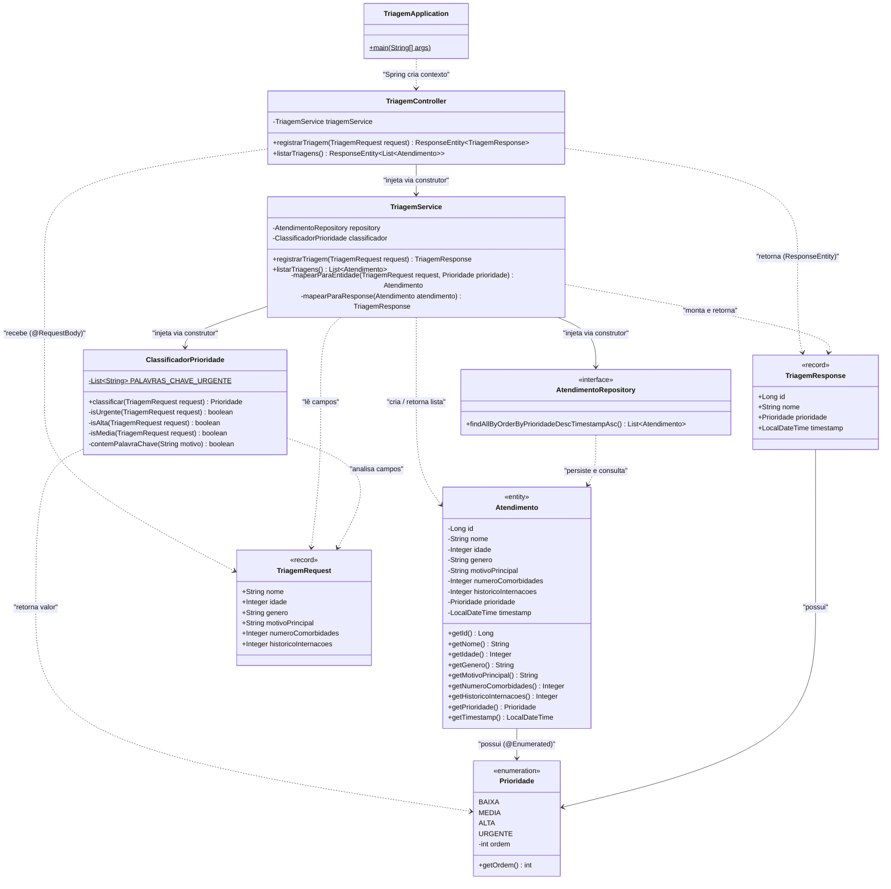

# C4 Model — Nível 4: Diagrama de Código (UML)
**Sistema:** Clinifying — Sistema de Triagem Assistida por IA  
**Nível:** 4 de 4  
**Pergunta respondida:** Como as classes se relacionam? Quais são os métodos, campos e dependências?

> Este é o **diagrama principal para o desenvolvimento**.  
> Use-o como guia ao criar cada arquivo `.java`. Cada caixa = um arquivo.

---

## Diagrama UML — Classes e Relacionamentos



---

## Mapa de arquivos Java

| Classe / Interface | Arquivo | Pacote | Camada |
|-------------------|---------|--------|--------|
| `TriagemApplication` | `TriagemApplication.java` | `com.hackathon.triagem` | Entry Point |
| `TriagemController` | `controller/TriagemController.java` | `com.hackathon.triagem.controller` | Controller |
| `TriagemService` | `service/TriagemService.java` | `com.hackathon.triagem.service` | Service |
| `ClassificadorPrioridade` | `service/ClassificadorPrioridade.java` | `com.hackathon.triagem.service` | Service |
| `AtendimentoRepository` | `repository/AtendimentoRepository.java` | `com.hackathon.triagem.repository` | Repository |
| `Atendimento` | `model/Atendimento.java` | `com.hackathon.triagem.model` | Model |
| `Prioridade` | `model/Prioridade.java` | `com.hackathon.triagem.model` | Model |
| `TriagemRequest` | `dto/TriagemRequest.java` | `com.hackathon.triagem.dto` | DTO |
| `TriagemResponse` | `dto/TriagemResponse.java` | `com.hackathon.triagem.dto` | DTO |

**Caminho base:** `src/back_end/com/hackathon/triagem/`

---

## Anotações Spring obrigatórias por classe

| Classe | Anotação de classe | Anotações de método/campo |
|--------|-------------------|--------------------------|
| `TriagemApplication` | `@SpringBootApplication` | — |
| `TriagemController` | `@RestController` `@RequestMapping("/api/triagem")` | `@PostMapping` `@GetMapping` `@Valid` |
| `TriagemService` | `@Service` | `@Transactional` no POST |
| `ClassificadorPrioridade` | `@Component` | — |
| `AtendimentoRepository` | — (é interface) | — |
| `Atendimento` | `@Entity` `@Table(name = "ATENDIMENTO")` | `@Id` `@GeneratedValue` `@Column` `@Enumerated(EnumType.STRING)` |

---

## Detalhamento: ClassificadorPrioridade (algoritmo de 9 passos)

```java
// Pseudocódigo — implementar exatamente esta lógica
public Prioridade classificar(TriagemRequest request) {

    // PASSO 1: palavra-chave crítica no motivo → URGENTE
    if (contemPalavraChave(request.motivoPrincipal().toLowerCase()))
        return Prioridade.URGENTE;

    // PASSO 2: idoso com múltiplas comorbidades → URGENTE
    if (request.idade() >= 70 && request.numeroComorbidades() >= 2)
        return Prioridade.URGENTE;

    // PASSO 3: muitas comorbidades → ALTA
    if (request.numeroComorbidades() >= 3)
        return Prioridade.ALTA;

    // PASSO 4: histórico de internações recorrente → ALTA
    if (request.historicoInternacoes() >= 2)
        return Prioridade.ALTA;

    // PASSO 5: idoso com comorbidade → ALTA
    if (request.idade() >= 60 && request.numeroComorbidades() >= 1)
        return Prioridade.ALTA;

    // PASSO 6: alguma comorbidade → MEDIA
    if (request.numeroComorbidades() >= 1)
        return Prioridade.MEDIA;

    // PASSO 7: algum histórico de internação → MEDIA
    if (request.historicoInternacoes() >= 1)
        return Prioridade.MEDIA;

    // PASSO 8: idoso sem comorbidades → MEDIA
    if (request.idade() >= 60)
        return Prioridade.MEDIA;

    // PASSO 9: caso base — paciente jovem saudável
    return Prioridade.BAIXA;
}
```

**Palavras-chave que triggeram URGENTE:**
```java
private static final List<String> PALAVRAS_CHAVE_URGENTE = List.of(
    "dor no peito", "falta de ar", "desmaio", "avc",
    "acidente vascular", "convulsão", "convulsao", "parada",
    "infarto", "hemorragia", "inconsciente", "inconsciência",
    "trauma", "overdose", "intoxicação", "intoxicacao"
);
```

---

## Detalhamento: Prioridade enum (com campo ordem para sort)

```java
public enum Prioridade {
    BAIXA(1),
    MEDIA(2),
    ALTA(3),
    URGENTE(4);

    private final int ordem;

    Prioridade(int ordem) {
        this.ordem = ordem;
    }

    public int getOrdem() {
        return ordem;
    }
}
```

> O campo `ordem` é necessário porque `ORDER BY prioridade DESC` com `EnumType.STRING`
> ordenaria alfabeticamente (errado). Com `ordem`, podemos ordenar por `a.prioridade.ordem DESC`.

---

## Detalhamento: AtendimentoRepository (query de ordenação)

```java
public interface AtendimentoRepository extends JpaRepository<Atendimento, Long> {

    // Spring Data deriva o SQL automaticamente a partir do nome do método:
    // ORDER BY prioridade DESC, timestamp ASC
    // ATENÇÃO: funciona com EnumType.STRING e os valores URGENTE > MEDIA > BAIXA > ALTA
    // Se a ordenação alfabética não funcionar corretamente, usar @Query:
    @Query("SELECT a FROM Atendimento a ORDER BY a.prioridade.ordem DESC, a.timestamp ASC")
    List<Atendimento> findAllOrdenadosPorPrioridade();
}
```

---

## Fluxo de dados completo

```
[src/front_end/index.html]
  │
  │  1. fetch('POST /api/triagem', body)
  ▼
[TriagemController] — src/back_end/.../controller/
  │  @Valid valida TriagemRequest
  │  chama triagemService.registrarTriagem(request)
  ▼
[TriagemService] — src/back_end/.../service/
  │
  ├─ classificador.classificar(request) → Prioridade ←[ClassificadorPrioridade]
  │
  ├─ monta Atendimento {
  │     nome = request.nome()
  │     idade = request.idade()
  │     ...
  │     prioridade = Prioridade.URGENTE (ex.)
  │     timestamp = LocalDateTime.now()
  │  }
  │
  ├─ repository.save(atendimento)  ←─────────────────[AtendimentoRepository]
  │      → Hibernate gera:                                    │
  │        INSERT INTO ATENDIMENTO (...) VALUES (...)   ←─[H2 Database]
  │        retorna atendimento com id=1
  │
  └─ monta TriagemResponse { id=1, nome, prioridade=URGENTE, timestamp }
  ▼
[TriagemController]
  │  retorna ResponseEntity.status(201).body(response)
  ▼
[src/front_end/index.html]
  │  2. exibe badge vermelho "URGENTE"
  │  3. fetch('GET /api/triagem') → recarrega tabela
  ▼
  Fila atualizada com João Silva no topo (urgente)
```

---

## Navegação do C4 Model

| Nível | Arquivo | Pergunta respondida |
|-------|---------|-------------------|
| 1 — Contexto | [nivel-1-contexto.md](nivel-1-contexto.md) | Quem usa e quais sistemas externos? |
| 2 — Contêineres | [nivel-2-containers.md](nivel-2-containers.md) | O que está dentro do sistema? |
| 3 — Componentes | [nivel-3-componentes.md](nivel-3-componentes.md) | O que está dentro do Backend API? |
| **4 — Código** | `nivel-4-codigo.md` ← *você está aqui* | Como as classes se relacionam? |
